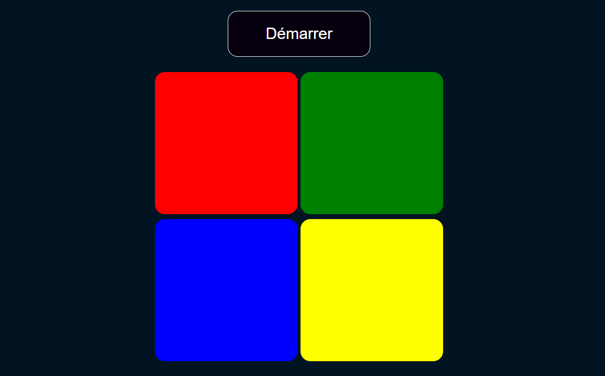

# OQUIZ

## Description
Welcome to Simon's Game, a classic memory game where you can test and improve your memory skills by following the pattern of colors.

## Technos
- HTML/CSS
- JavaScript Vanilla

## Preview

## How to use ?
Follow these steps to set up and use the application:
1. Clone the repo
2. Open the index.html file in your browser.
3. Enjoy playing Simon's Game and challenge your memory!